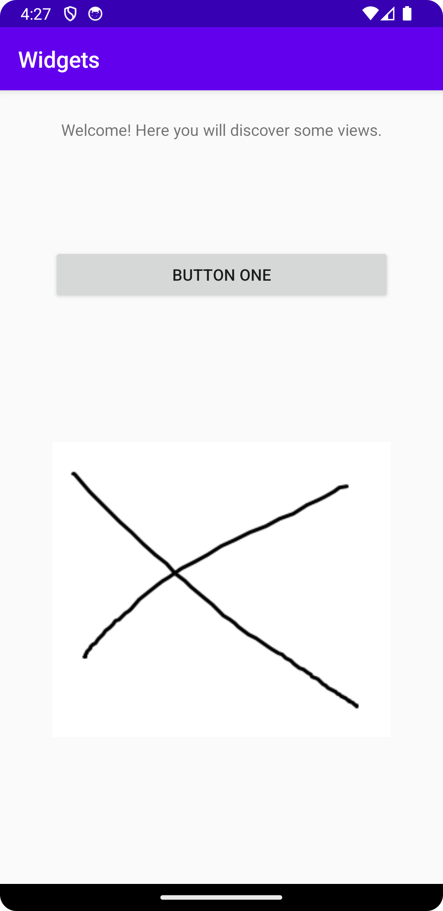

# Rapport
I have chosen to use ConstraintLayout. I have edited the TextViews text, ID and also changed the margins. I have also added an ImageView and a Button. The ImageView is of an X and the Button says Button One, both of 
these margins have also been edited resulting in different positions in the layout. 

The following code shows the code for the button which is named "mybutton". Here you can for example see that margins, ID and text is changed. 
I wanted the button to be placed under the text so I have used "app:layout_constraintTop_toBottomOf="@id/mytext"" and then I added some additional space
from the top with android:layout_marginTop="95dp"  There is a also a screenshot attached "Widgets.png" where the layout of the screen is shown on 
execution.

<Button
android:id="@+id/mybutton"
android:layout_width="300dp"
android:layout_height="wrap_content"
android:text="Button One"
android:layout_marginTop="95dp"
app:layout_constraintTop_toBottomOf="@id/mytext"
app:layout_constraintStart_toStartOf="parent"
app:layout_constraintEnd_toEndOf="parent"
/>
## Följande grundsyn gäller dugga-svar:

- Ett kortfattat svar är att föredra. Svar som är längre än en sida text (skärmdumpar och programkod exkluderat) är onödigt långt.
- Svaret skall ha minst en snutt programkod.
- Svaret skall inkludera en kort övergripande förklarande text som redogör för vad respektive snutt programkod gör eller som svarar på annan teorifråga.
- Svaret skall ha minst en skärmdump. Skärmdumpar skall illustrera exekvering av relevant programkod. Eventuell text i skärmdumpar måste vara läsbar.
- I de fall detta efterfrågas, dela upp delar av ditt svar i för- och nackdelar. Dina för- respektive nackdelar skall vara i form av punktlistor med kortare stycken (3-4 meningar).

Programkod ska se ut som exemplet nedan. Koden måste vara korrekt indenterad då den blir lättare att läsa vilket gör det lättare att hitta syntaktiska fel.

```
function errorCallback(error) {
    switch(error.code) {
        case error.PERMISSION_DENIED:
            // Geolocation API stöds inte, gör något
            break;
        case error.POSITION_UNAVAILABLE:
            // Misslyckat positionsanrop, gör något
            break;
        case error.UNKNOWN_ERROR:
            // Okänt fel, gör något
            break;
    }
}
```

Bilder läggs i samma mapp som markdown-filen.



Läs gärna:

- Boulos, M.N.K., Warren, J., Gong, J. & Yue, P. (2010) Web GIS in practice VIII: HTML5 and the canvas element for interactive online mapping. International journal of health geographics 9, 14. Shin, Y. &
- Wunsche, B.C. (2013) A smartphone-based golf simulation exercise game for supporting arthritis patients. 2013 28th International Conference of Image and Vision Computing New Zealand (IVCNZ), IEEE, pp. 459–464.
- Wohlin, C., Runeson, P., Höst, M., Ohlsson, M.C., Regnell, B., Wesslén, A. (2012) Experimentation in Software Engineering, Berlin, Heidelberg: Springer Berlin Heidelberg.
